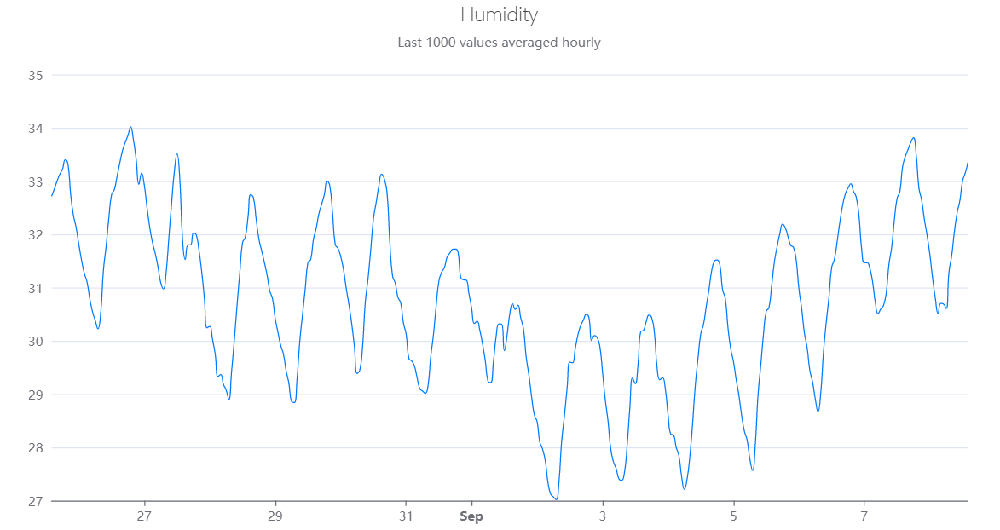

<!-- README.md is generated from README.Rmd. Please edit that file -->

```{r, include = FALSE}
knitr::opts_chunk$set(
  collapse = TRUE,
  comment = "#>",
  fig.path = "man/figures/README-",
  out.width = "100%"
)
```

# Rduinoiot 

<!-- badges: start -->
[](https://CRAN.R-project.org/package=Rduinoiot)
[](https://lifecycle.r-lib.org/articles/stages.html#experimental)
[](https://github.com/FlavioLeccese92/Rduinoiot/actions)
<!-- badges: end -->

**Rduinoiot** provides an easy way to connect to [Arduino Iot Cloud API](<https://create.arduino.cc/iot/>) with R.
Functions allow to exploit [API methods](<https://www.arduino.cc/reference/en/iot/api/>) for many purposes, manage your Arduino devices and dashboards and access to the data produced by sensors and sketches.
This is not an official library by Arduino.

## Installation

To get the current released version from CRAN:

```{r install-cran, eval=FALSE, include=TRUE}
install.packages("Rduinoiot")
```

To get the current development version from [GitHub](<https://github.com/>):

```{r install-github, eval=FALSE, include=TRUE}
# install.packages("devtools")
devtools::install_github("FlavioLeccese92/Rduinoiot")
```
## Authentication

In order to access the API methods you need to create an API key. This can be done by logging into your Arduino Cloud account and going to the page `https://cloud.arduino.cc/home/api-keys/` and retrieve corresponding `ARDUINO_API_CLIENT_ID` and `ARDUINO_API_CLIENT_SECRET`.


```{r init}
library(Rduinoiot)
# Sys.setenv(ARDUINO_API_CLIENT_ID = 'INSERT CLIENT_ID HERE')
# Sys.setenv(ARDUINO_API_CLIENT_SECRET = 'INSERT CLIENT_SECRET HERE')

create_auth_token()
```

## List things associated to the user

Things associated to the user account can be easily accessed using  `things_list()`.
This function will return detailed information, in particular `things_id` which are needed to access to properties.

```{r example 1}
tl = things_list()
``` 
```{r example 1 - run, echo=FALSE, message=FALSE, warning=FALSE}
library(kableExtra)

tl %>%
  kbl(longtable = TRUE) %>%
  kable_paper(full_width = FALSE, html_font = '"Open Sans", sans-serif') %>%
  kable_styling(font_size = 12) %>%
  column_spec(column = c(1, 8), width_min = "1.6in") %>%
  column_spec(column = 4, width_min = "2in") %>%
  column_spec(column = c(2, 3, 6, 9, 11), width_min = "2.6in")
```
## Real-time sensor data

Reading real-time humidity sensor of one of your devices can be done as follow:

```{r example 2}
thing_id = "b6822400-2f35-4d93-b3e7-be919bdc5eba"
property_id = "d1134fe1-6519-49f1-afd8-7fe9e891e778" # (Humidity)

data_ts = things_properties_timeseries(thing_id = thing_id,
                                       property_id = property_id,
                                       desc = FALSE, interval = 3600)
```
```{r example 2 -  run, echo=FALSE}
data_ts %>%
  head(10)%>%
  kbl(longtable = TRUE) %>%
  kable_styling(font_size = 12)  %>%
  kable_paper(full_width = FALSE, html_font = '"Open Sans", sans-serif') %>%
  column_spec(column = 1, width_min = "1.6in")
```

## Plotting the result

A catchy representation of humidity time series can be plotted, for instance, by using the library [echarts4r](<https://echarts4r.john-coene.com/>) by [John Coene](<https://john-coene.com/>):

```{r example 3, eval=FALSE, echo=TRUE, message=FALSE, warning=FALSE}
library(echarts4r)
library(dplyr)
library(lubridate)

data_ts = data_ts %>% mutate(time = with_tz(time, tzone = Sys.timezone()))

data_ts %>%
  e_charts(time) %>%
  e_line(value, name = "Value", color = "#007BFF", showSymbol = FALSE, smooth = TRUE,
         connectNulls = TRUE, animation = FALSE, emphasis = NULL,
         lineStyle = list(width = 1)) %>%
  e_title(left = 'center', text = "Humidity",
          subtext = "Last 1000 values averaged hourly",
          textStyle = list(fontWeight = 'lighter')) %>%
  e_grid(top = 70, right = 30, left = 50, bottom = 30) %>%
  e_x_axis(show = TRUE, type = "time") %>%
  e_y_axis(show = TRUE, scale = TRUE) %>%
  e_legend(show = FALSE)
```

