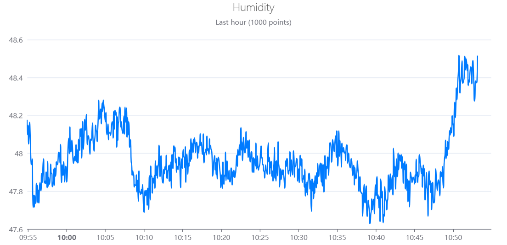

<!-- README.md is generated from README.Rmd. Please edit that file -->

# Rduinoiot 

<!-- badges: start -->

[](https://CRAN.R-project.org/package=Rduinoiot)
[](https://lifecycle.r-lib.org/articles/stages.html#experimental)
[](https://github.com/FlavioLeccese92/Rduinoiot/actions)
<!-- badges: end -->

**Rduinoiot** provides an easy way to connect to [Arduino Iot Cloud
API](https://create.arduino.cc/iot/) with R. Functions allow to exploit
[API methods](https://www.arduino.cc/reference/en/iot/api) for many
purposes, manage your Arduino devices and dashboards and access to the
data produced by sensors and sketches.

## Installation

You can install the development version of Rduinoiot from
[GitHub](https://github.com/) with:

``` r
# install.packages("devtools")
devtools::install_github("FlavioLeccese92/Rduinoiot")
```

## Authentication

``` r
library(Rduinoiot)
# Sys.setenv(ARDUINO_API_CLIENT_ID = 'INSERT CLIENT_ID HERE')
# Sys.setenv(ARDUINO_API_CLIENT_SECRET = 'INSERT CLIENT_SECRET HERE')

create_auth_token()
#> v Authorization succeeded
```

## List things associated to the user

Things associated to the user account can be easily accessed using
`things_list()`. This function will return detailed information, in
particular `things_id` which are needed to access to properties.

``` r
create_auth_token()
#> v Authorization succeeded

things_list()
#> v Method succeeded
#> # A tibble: 4 x 13
#>   created_at          href                   id    name  prope~1 sketc~2 timez~3
#>   <dttm>              <chr>                  <chr> <chr>   <int> <chr>   <chr>  
#> 1 2022-08-12 13:49:43 /iot/v1/things/0b18eb~ 0b18~ Smar~       8 7a8e48~ Americ~
#> 2 2022-08-12 18:24:07 /iot/v1/things/60ef77~ 60ef~ Home~       7 87cbfd~ Americ~
#> 3 2022-08-12 21:57:28 /iot/v1/things/b68224~ b682~ Pers~       5 0ef1dc~ Americ~
#> 4 2022-08-12 13:32:16 /iot/v1/things/bc3b27~ bc3b~ Thin~       2 3a558c~ Americ~
#> # ... with 6 more variables: updated_at <dttm>, user_id <chr>,
#> #   device_fqbn <chr>, device_id <chr>, device_name <chr>, device_type <chr>,
#> #   and abbreviated variable names 1: properties_count, 2: sketch_id,
#> #   3: timezone
```

## Real-time sensor data

Reading real-time humidity sensor of one of your devices can be done
like this:

``` r
thing_id = "b6822400-2f35-4d93-b3e7-be919bdc5eba"
property_id = "d1134fe1-6519-49f1-afd8-7fe9e891e778" # Humidity

data_ts = things_properties_timeseries(thing_id = thing_id,
                                       property_id = property_id,
                                       desc = FALSE, interval = 3600)
#> v Method succeeded
data_ts
#> # A tibble: 337 x 2
#>    time                value
#>    <dttm>              <dbl>
#>  1 2022-08-25 10:00:00  32.3
#>  2 2022-08-25 11:00:00  32.4
#>  3 2022-08-25 12:00:00  32.6
#>  4 2022-08-25 13:00:00  32.8
#>  5 2022-08-25 14:00:00  33.0
#>  6 2022-08-25 15:00:00  33.1
#>  7 2022-08-25 16:00:00  33.2
#>  8 2022-08-25 17:00:00  33.4
#>  9 2022-08-25 18:00:00  33.3
#> 10 2022-08-25 19:00:00  32.7
#> # ... with 327 more rows
```

## Plotting the result

``` r
library(echarts4r)
library(dplyr)
library(lubridate)

data_ts = data_ts %>% mutate(time = with_tz(time, tzone = Sys.timezone()))

data_ts %>%
  e_charts(time) %>%
  e_line(value, name = "Value", color = "#007BFF", showSymbol = FALSE, smooth = TRUE,
         connectNulls = TRUE, animation = FALSE, emphasis = NULL) %>%
  e_title(left = 'center', text = "Humidity",
          subtext = "Last 1000 values averaged hourly",
          textStyle = list(fontWeight = 'lighter')) %>%
  e_grid(top = 70, right = 30, left = 50, bottom = 30) %>%
  e_x_axis(show = TRUE, type = "time") %>%
  e_y_axis(show = TRUE, scale = TRUE) %>%
  e_legend(show = FALSE)
```


