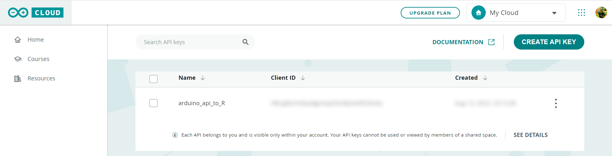
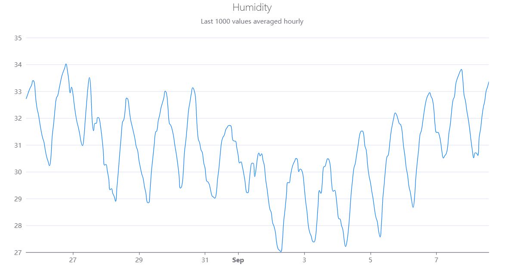

<!-- README.md is generated from README.Rmd. Please edit that file -->

# Rduinoiot 

<!-- badges: start -->

[](https://CRAN.R-project.org/package=Rduinoiot)
[](https://lifecycle.r-lib.org/articles/stages.html#experimental)
[](https://github.com/FlavioLeccese92/Rduinoiot/actions)
<!-- badges: end -->

**Rduinoiot** provides an easy way to connect to [Arduino Iot Cloud
API](https://create.arduino.cc/iot/) with R. Functions allow to exploit
[API methods](https://www.arduino.cc/reference/en/iot/api/) for many
purposes, manage your Arduino devices and dashboards and access to the
data produced by sensors and sketches. This is not an official library
by Arduino.

## Installation

To get the current released version from CRAN:

``` r
install.packages("Rduinoiot")
```

To get the current development version from
[GitHub](https://github.com/):

``` r
# install.packages("devtools")
devtools::install_github("FlavioLeccese92/Rduinoiot")
```

## Authentication

In order to access the API methods you need to create an API key. This
can be done by logging into your Arduino Cloud account and going to the
page `https://cloud.arduino.cc/home/api-keys/` and retrieve
corresponding `ARDUINO_API_CLIENT_ID` and `ARDUINO_API_CLIENT_SECRET`.



``` r
library(Rduinoiot)
# Sys.setenv(ARDUINO_API_CLIENT_ID = 'INSERT CLIENT_ID HERE')
# Sys.setenv(ARDUINO_API_CLIENT_SECRET = 'INSERT CLIENT_SECRET HERE')

create_auth_token()
#> v Method succeeded
```

## List things associated to the user

Things associated to the user account can be easily accessed using
`things_list()`. This function will return detailed information, in
particular `things_id` which are needed to access to properties.

``` r
tl = things_list()
#> v Method succeeded
```

<table class=" lightable-paper table" style="font-family: &quot;Open Sans&quot;, sans-serif; width: auto !important; margin-left: auto; margin-right: auto; font-size: 12px; margin-left: auto; margin-right: auto;">
<thead>
<tr>
<th style="text-align:left;">
created\_at
</th>
<th style="text-align:left;">
href
</th>
<th style="text-align:left;">
id
</th>
<th style="text-align:left;">
name
</th>
<th style="text-align:right;">
properties\_count
</th>
<th style="text-align:left;">
sketch\_id
</th>
<th style="text-align:left;">
timezone
</th>
<th style="text-align:left;">
updated\_at
</th>
<th style="text-align:left;">
user\_id
</th>
<th style="text-align:left;">
device\_fqbn
</th>
<th style="text-align:left;">
device\_id
</th>
<th style="text-align:left;">
device\_name
</th>
<th style="text-align:left;">
device\_type
</th>
</tr>
</thead>
<tbody>
<tr>
<td style="text-align:left;min-width: 1.6in; ">
2022-08-12 13:49:43
</td>
<td style="text-align:left;min-width: 2.6in; ">
/iot/v1/things/0b18eba2-2aba-4740-8bec-5043403ecdd9
</td>
<td style="text-align:left;min-width: 2.6in; ">
0b18eba2-2aba-4740-8bec-5043403ecdd9
</td>
<td style="text-align:left;min-width: 2in; ">
Smart Garden
</td>
<td style="text-align:right;">
8
</td>
<td style="text-align:left;min-width: 2.6in; ">
7a8e48be-e77d-401c-8ef7-05bd6e7b4c27
</td>
<td style="text-align:left;">
America/New\_York
</td>
<td style="text-align:left;min-width: 1.6in; ">
2022-08-12 18:23:38
</td>
<td style="text-align:left;min-width: 2.6in; ">
fd39fa13-cbac-49ac-9316-cbdf452ba1c9
</td>
<td style="text-align:left;">
NA
</td>
<td style="text-align:left;min-width: 2.6in; ">
NA
</td>
<td style="text-align:left;">
NA
</td>
<td style="text-align:left;">
NA
</td>
</tr>
<tr>
<td style="text-align:left;min-width: 1.6in; ">
2022-08-12 18:24:07
</td>
<td style="text-align:left;min-width: 2.6in; ">
/iot/v1/things/60ef7770-90c0-4068-ac3d-8a2301c3ac3d
</td>
<td style="text-align:left;min-width: 2.6in; ">
60ef7770-90c0-4068-ac3d-8a2301c3ac3d
</td>
<td style="text-align:left;min-width: 2in; ">
Home Security Alarm
</td>
<td style="text-align:right;">
7
</td>
<td style="text-align:left;min-width: 2.6in; ">
87cbfdec-b965-4a04-814a-232f65ac2f8e
</td>
<td style="text-align:left;">
America/New\_York
</td>
<td style="text-align:left;min-width: 1.6in; ">
2022-08-12 18:42:09
</td>
<td style="text-align:left;min-width: 2.6in; ">
fd39fa13-cbac-49ac-9316-cbdf452ba1c9
</td>
<td style="text-align:left;">
NA
</td>
<td style="text-align:left;min-width: 2.6in; ">
NA
</td>
<td style="text-align:left;">
NA
</td>
<td style="text-align:left;">
NA
</td>
</tr>
<tr>
<td style="text-align:left;min-width: 1.6in; ">
2022-08-12 21:57:28
</td>
<td style="text-align:left;min-width: 2.6in; ">
/iot/v1/things/b6822400-2f35-4d93-b3e7-be919bdc5eba
</td>
<td style="text-align:left;min-width: 2.6in; ">
b6822400-2f35-4d93-b3e7-be919bdc5eba
</td>
<td style="text-align:left;min-width: 2in; ">
Personal Weather Station
</td>
<td style="text-align:right;">
5
</td>
<td style="text-align:left;min-width: 2.6in; ">
0ef1dc12-dd8f-477e-963a-f7734b5ff141
</td>
<td style="text-align:left;">
America/New\_York
</td>
<td style="text-align:left;min-width: 1.6in; ">
2022-08-12 21:59:46
</td>
<td style="text-align:left;min-width: 2.6in; ">
fd39fa13-cbac-49ac-9316-cbdf452ba1c9
</td>
<td style="text-align:left;">
arduino:samd:mkrwifi1010
</td>
<td style="text-align:left;min-width: 2.6in; ">
fa7ee291-8dc8-4713-92c7-9027969e4aa1
</td>
<td style="text-align:left;">
MFA
</td>
<td style="text-align:left;">
mkrwifi1010
</td>
</tr>
<tr>
<td style="text-align:left;min-width: 1.6in; ">
2022-08-12 13:32:16
</td>
<td style="text-align:left;min-width: 2.6in; ">
/iot/v1/things/bc3b2763-a775-4fc8-95da-c03235d47f3a
</td>
<td style="text-align:left;min-width: 2.6in; ">
bc3b2763-a775-4fc8-95da-c03235d47f3a
</td>
<td style="text-align:left;min-width: 2in; ">
Thinking About You
</td>
<td style="text-align:right;">
2
</td>
<td style="text-align:left;min-width: 2.6in; ">
3a558c37-f087-47e9-8f01-339b40fc6dd9
</td>
<td style="text-align:left;">
America/New\_York
</td>
<td style="text-align:left;min-width: 1.6in; ">
2022-08-12 13:40:06
</td>
<td style="text-align:left;min-width: 2.6in; ">
fd39fa13-cbac-49ac-9316-cbdf452ba1c9
</td>
<td style="text-align:left;">
NA
</td>
<td style="text-align:left;min-width: 2.6in; ">
NA
</td>
<td style="text-align:left;">
NA
</td>
<td style="text-align:left;">
NA
</td>
</tr>
</tbody>
</table>

## Real-time sensor data

Reading real-time humidity sensor of one of your devices can be done as
follow:

``` r
thing_id = "b6822400-2f35-4d93-b3e7-be919bdc5eba"
property_id = "d1134fe1-6519-49f1-afd8-7fe9e891e778" # Humidity

data_ts = things_properties_timeseries(thing_id = thing_id,
                                       property_id = property_id,
                                       desc = FALSE, interval = 3600)
#> v Method succeeded
```

<table class="table lightable-paper" style="font-size: 12px; margin-left: auto; margin-right: auto; font-family: &quot;Open Sans&quot;, sans-serif; width: auto !important; margin-left: auto; margin-right: auto;">
<thead>
<tr>
<th style="text-align:left;">
time
</th>
<th style="text-align:right;">
value
</th>
</tr>
</thead>
<tbody>
<tr>
<td style="text-align:left;min-width: 1.6in; ">
2022-08-31 10:00:00
</td>
<td style="text-align:right;">
31.12757
</td>
</tr>
<tr>
<td style="text-align:left;min-width: 1.6in; ">
2022-08-31 11:00:00
</td>
<td style="text-align:right;">
31.28831
</td>
</tr>
<tr>
<td style="text-align:left;min-width: 1.6in; ">
2022-08-31 12:00:00
</td>
<td style="text-align:right;">
31.37407
</td>
</tr>
<tr>
<td style="text-align:left;min-width: 1.6in; ">
2022-08-31 13:00:00
</td>
<td style="text-align:right;">
31.57041
</td>
</tr>
<tr>
<td style="text-align:left;min-width: 1.6in; ">
2022-08-31 14:00:00
</td>
<td style="text-align:right;">
31.64814
</td>
</tr>
<tr>
<td style="text-align:left;min-width: 1.6in; ">
2022-08-31 15:00:00
</td>
<td style="text-align:right;">
31.71925
</td>
</tr>
<tr>
<td style="text-align:left;min-width: 1.6in; ">
2022-08-31 16:00:00
</td>
<td style="text-align:right;">
31.72388
</td>
</tr>
<tr>
<td style="text-align:left;min-width: 1.6in; ">
2022-08-31 17:00:00
</td>
<td style="text-align:right;">
31.67160
</td>
</tr>
<tr>
<td style="text-align:left;min-width: 1.6in; ">
2022-08-31 18:00:00
</td>
<td style="text-align:right;">
31.19190
</td>
</tr>
<tr>
<td style="text-align:left;min-width: 1.6in; ">
2022-08-31 19:00:00
</td>
<td style="text-align:right;">
31.14528
</td>
</tr>
</tbody>
</table>

## Plotting the result

A catchy representation of humidity time series can be plotted, for
instance, by using the library
[echarts4r](https://echarts4r.john-coene.com/) by [John
Coene](https://john-coene.com/):

``` r
library(echarts4r)
library(dplyr)
library(lubridate)

data_ts = data_ts %>% mutate(time = with_tz(time, tzone = Sys.timezone()))

data_ts %>%
  e_charts(time) %>%
  e_line(value, name = "Value", color = "#007BFF", showSymbol = FALSE, smooth = TRUE,
         connectNulls = TRUE, animation = FALSE, emphasis = NULL,
         lineStyle = list(width = 1)) %>%
  e_title(left = 'center', text = "Humidity",
          subtext = "Last 1000 values averaged hourly",
          textStyle = list(fontWeight = 'lighter')) %>%
  e_grid(top = 70, right = 30, left = 50, bottom = 30) %>%
  e_x_axis(show = TRUE, type = "time") %>%
  e_y_axis(show = TRUE, scale = TRUE) %>%
  e_legend(show = FALSE)
```


