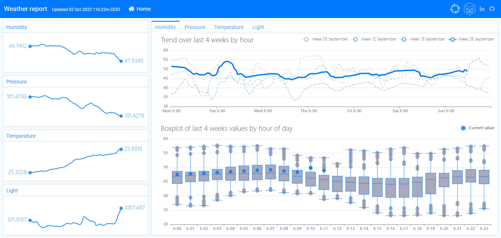
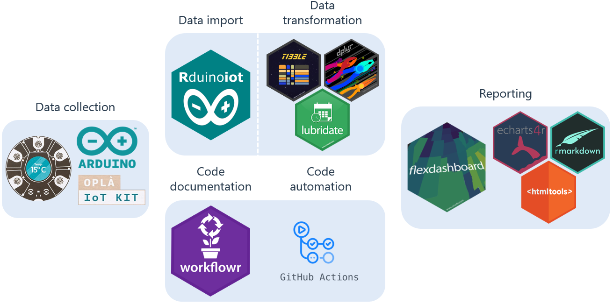

```{r, include = FALSE}
knitr::opts_chunk$set(
  collapse = TRUE,
  comment = "#>"
)
```

Usage of `Rduinoiot` in a project can be found here:

<center><font size="5">**https://flavioleccese92.github.io/Rduinoiot-analysis/weather-report**</font></center>

<center><div style="margin-top:20px; margin-bottom:20px;">

</div></center>

The `flexdashboard` connected to one [**Arduino Oplà Iot kit**](https://opla.arduino.cc/){target="_blank"}
of mine, whose sensor valus are processed to the dashboard based on this setup:

<center><div style="margin-top:20px; margin-bottom:20px;">

</div></center>

More information is available here:

<center><font size="5">**https://flavioleccese92.github.io/Rduinoiot-analysis/**</font></center>
